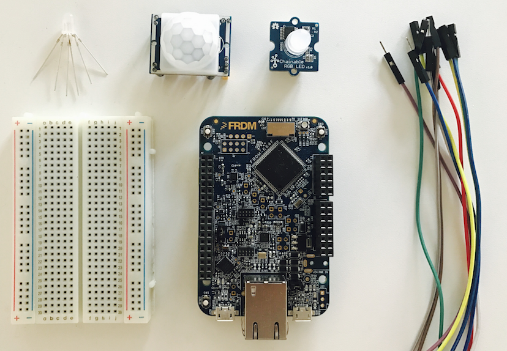

## Building an internet connected lighting system

In this tutorial we'll use the ARM mbed IoT Device Platform to build a complete connected lighting system that you can deploy in your house or office. The system consists of one (or more) extra-bright RGB LEDs hooked up to an mbed OS development board. The lights can be turned on or off by a motion sensor, but are also connected to the internet, so you can change their color. The system uses mbed Cloud to connect to the internet, is secured end-to-end, and can be updated via over-the-air firmware updates.

We'll go over all the steps required to build the hardware, the cloud integration, and the application. At the end of the tutorial you'll have a firm understanding of building complete connected IoT solutions on the mbed IoT Device Platform. You'll also have a cool light.

### Requirements

We need the following hardware:

* A [development board](https://developer.mbed.org/platforms/?software=16) capable of connecting to mbed Cloud. Either:
    * [NXP FRDM-K64F](https://developer.mbed.org/platforms/FRDM-K64F/) using Ethernet.
    * [ST NUCLEO-F429ZI](https://developer.mbed.org/platforms/ST-Nucleo-F429ZI/) with Ethernet.
    * [Ameba RTL8195]() with Wi-Fi.
    * [u-blox EVK-ODIN-W2](https://developer.mbed.org/platforms/ublox-EVK-ODIN-W2/) with Ethernet and Wi-Fi.
* A breadboard, to hook up the components.
* A PIR sensor to detect motion.
* An RGB LED - preferably an extra-bright one.
    * For a better effect you can also use a [Grove Chainable LED](http://wiki.seeed.cc/Grove-Chainable_RGB_LED/).
    * After building the original application, you can easily swap out the LED for something [fancier](https://www.adafruit.com/product/1138).
* Some jumper wires. Both male-male and male-female.
* Resistors: 1x 100 Ohm, 2x 220 Ohm.

Components required to build our lighting system. Top row: RGB LED, PIR sensor, Grove Chainable LED. Bottom row: breadboard, NXP FRDM-K64F, jumper wires.

We also need:

* An account on [developer.mbed.org](https://developer.mbed.org/) to access the online compiler.
* An account on [portal.mbedcloud.com](https://portal.mbedcloud.com) to access to the mbed Cloud Portal.
